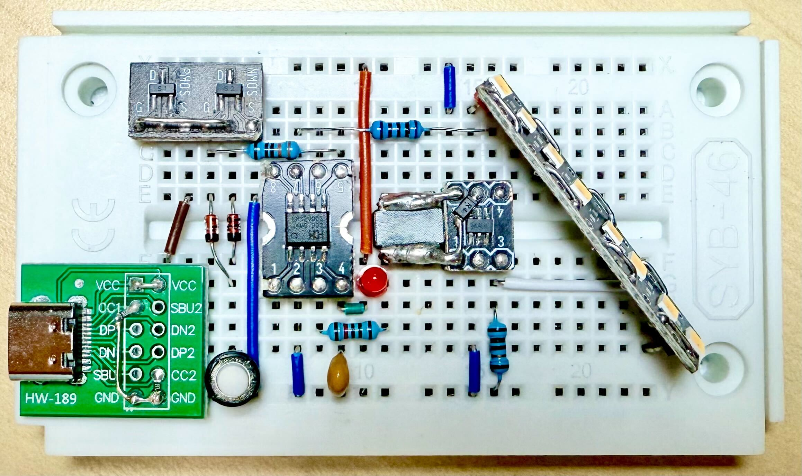

# Portable LED Light with CH32V003 & SGM3732



- [Portable LED Light with CH32V003 \& SGM3732](#portable-led-light-with-ch32v003--sgm3732)
  - [Features](#features)
  - [About the CH32V003](#about-the-ch32v003)
  - [About the SGM3732](#about-the-sgm3732)
  - [Minimized ch32fun Library](#minimized-ch32fun-library)
  - [References](#references)


## Features

- Low-Cost.
- PWM-controlled brightness.
- Up to 10 LEDs in series.
- 2.7V to 5.5V power, good for lithium battery.
- Soft Latching Power Circuit – Ideal for battery-powered applications, as it draws no current once powered off.

## About the CH32V003

The CH32V003 is a low-cost, high-performance 32-bit RISC-V microcontroller from WCH. It features a compact design, low power consumption, and a rich set of peripherals, making it ideal for embedded applications and cost-sensitive projects. The CH32V003 supports various interfaces such as UART, SPI, I2C, and PWM, and is well-suited for controlling LED drivers and other hardware components.

## About the SGM3732

The [SGM3732](https://www.sg-micro.com/product/SGM3732) is a high-efficiency constant current LED driver with a 1.1MHz PWM boost converter, optimized for compact designs using small components. It can drive up to 10 LEDs in series (up to 38V output) or deliver up to 260mA with 3 LEDs per string, while maintaining high conversion efficiency. LED current is programmable via a digital PWM dimming interface (2kHz–60kHz). The device features very low shutdown current and includes protections such as over-voltage, cycle-by-cycle input current limit, and thermal shutdown. The SGM3732 is available in a TSOT-23-6 package and operates from -40℃ to +85℃.

## Minimized ch32fun Library

Some modifications have been made to accommodate library and tool paths.

- `ch32fun.mk`

    ```diff
    33c33
    < MINICHLINK?=$(CH32FUN)/../minichlink
    ---
    > MINICHLINK?=$(CH32FUN)
    51c51
    <     LDFLAGS+=-L$(CH32FUN)/../misc -lgcc
    ---
    >     LDFLAGS+=-L$(CH32FUN) -lgcc
    350c350
    <     make -C $(MINICHLINK) all
    ---
    >     # make -C $(MINICHLINK) all
    ```

- `ch32fun.c`
  Updated line 1728 for HCLK.

    ```c
    1720: #elif defined(FUNCONF_USE_HSI) && FUNCONF_USE_HSI
    1721: #if defined(CH32V30x) || defined(CH32V20x) || defined(CH32V10x)
    1722:     EXTEN->EXTEN_CTR |= EXTEN_PLL_HSI_PRE;
    1723: #endif
    1724: #if defined(FUNCONF_USE_PLL) && FUNCONF_USE_PLL
    1725:     RCC->CFGR0 = BASE_CFGR0;
    1726:     RCC->CTLR  = BASE_CTLR | RCC_HSION | RCC_PLLON; // Use HSI, enable PLL.
    1727: #else
    1728:     RCC->CFGR0 = RCC_HPRE_DIV16;                    // HCLK = SYSCLK / 16
    1729:     RCC->CTLR  = BASE_CTLR | RCC_HSION;             // Use HSI only.
    1730: #endif
    ```

## References

- [Andrew Levido: Soft Latching Power Circuits](https://circuitcellar.com/resources/quickbits/soft-latching-power-circuits/)
- [CNLohr: ch32fun](https://github.com/cnlohr/ch32fun)
- [A Guide to Debouncing](https://my.eng.utah.edu/~cs5780/debouncing.pdf)
- [The simplest button debounce solution](https://www.e-tinkers.com/2021/05/the-simplest-button-debounce-solution/)
- [Museum of the Game - Let's design some POKEY replacements](https://forums.arcade-museum.com/threads/lets-design-some-pokey-replacements.515774/post-4623716)
